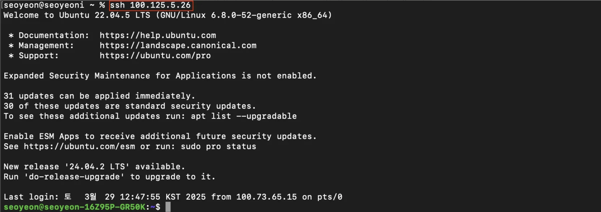
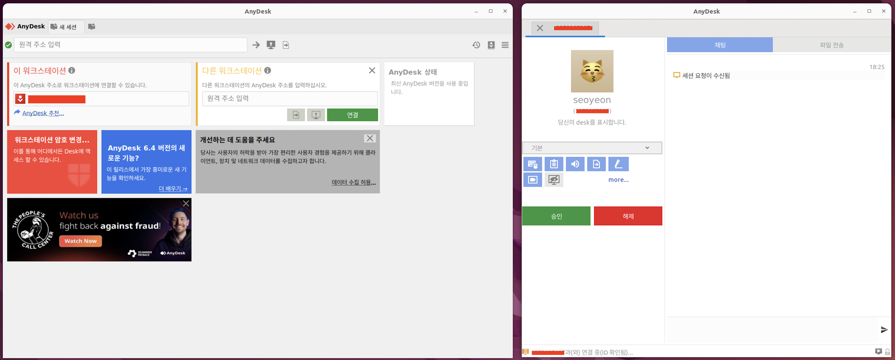
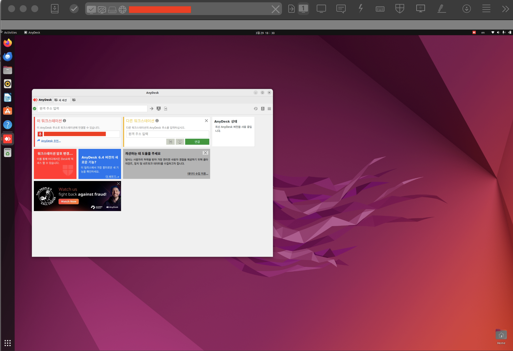
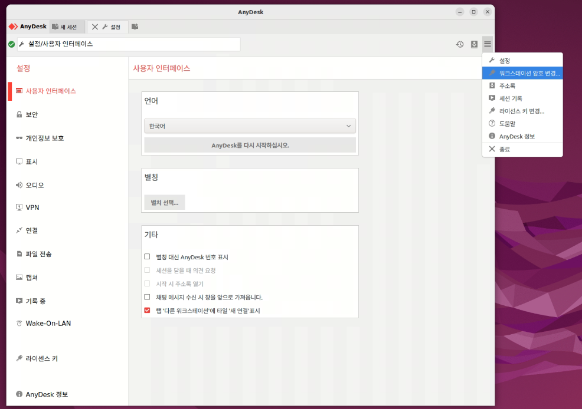
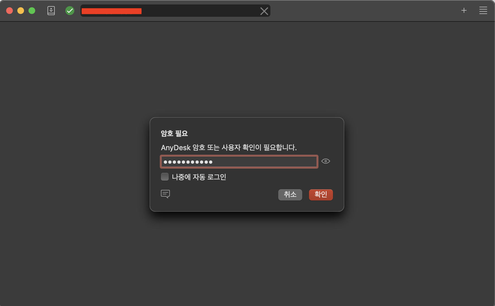
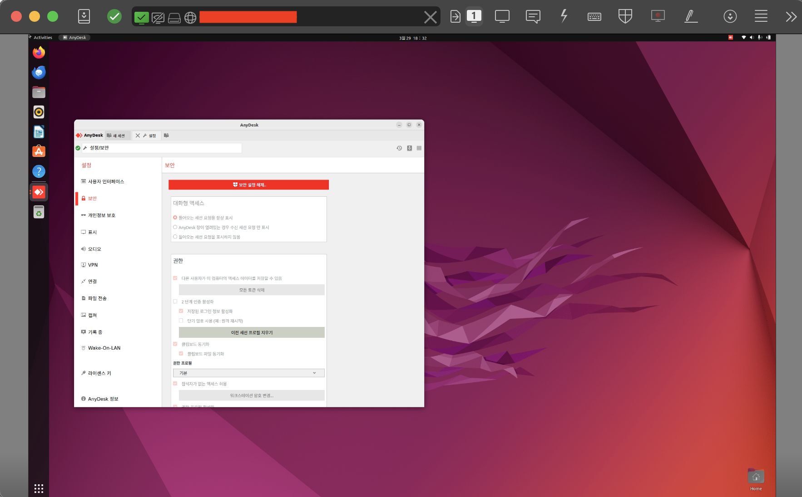

## Introduction

- 홈서버 첫 주차로 "서버 구성"과 "서버-클라이언트 간의 통신이 가능하도록 설정"하는 것이 핵심

- 홈서버 구성
  - Ubuntu 22.04

- Tailscale
  - Client-Server SSH 접속 목적

- Anydesk
  - Client-Server 원격 제어 목적

## Terminology

### VPN

- 개념 및 특징

  - VPN이란 네트워크망을 암호화해 다른 지역에서도 인터넷으로 사설망에 안전하게 접근할 수 있게 하는 기술

  - 확장성이 좋으며 보안 보장

- **홈서버와 VPN**

  - 트래픽을 암호화해 데이터 유출 위험 감소 → 외부에서 서버에 안전하게 접속 가능
    
  - IP 주소 고정할 필요 없어짐 → 별도의 DNS 설정 없이 홈서버 네트워크 내에 접속하는 것과 같이 서버에 접속 가능
    

- **Tailscale**

  - VPN 서비스 중 하나
  - 설정이 간단
  - 오픈 소스 소프트웨어 WireGuard 프로토콜을 기반으로 구축

- WireGuard

  - WireGuard는 암호화된 가상 사설망을 구현하는 통신 프로토콜
  - 간단하고 속도가 빠르며 보안에 유리

### BalenaEtcher vs Rufus vs Ventoy

> 공통점 - Bootable 미디어를 만들 때 사용하는 소프트웨어
> 

1. **BalenaEtcher**

- MacOS, Windows, Ubuntu를 포함한 리눅스까지 지원

- Ubuntu가 bootable USB 만들 때 **공식으로 권장**하는 소프트웨어

2. **Rufus**

- Windows에서 부팅 가능한 USB 드라이브 만드는데 사용

3. **Ventoy**

- USB 드라이브에 여러 개의 ISO 파일을 넣고 하나의 드라이브에서 부팅할 수 있도록 함

### BIOS (Basic Input Output System)

- BIOS란, 컴퓨터 하드웨어와 소프트웨어를 연결하는 펌웨어

- 컴퓨터가 시작되고 하드웨어 초기화하는데 사용

  → CPU, RAM, GPU, 스토리지 등 컴퓨터의 모든 구성 요소가 올바르게 인식되고 작동하는지 확인

## Practice: Server OS Setting

### 동작 과정

> 스터디장 제공 Bootable Drive 사용

1. Bootable Drive 생성 후 Server에 연결

- Rufus, BalenaEtcher, Ventoy 사용해 원하는 OS의 Bootable Drive 생성

2. BIOS 설정

- BIOS 진입
  - 기기에 따라 다름 → F1~F12 사이의 단축키
  -  LG Gram의 BIOS 단축키 F2

- 부팅 순서 설정
  - 아래의 Rufus, BalenaEtcher, Ventoy 등을 사용해 생성한 USB 드라이브 사용한다고 가정
  - “Boot” 탭에서 부팅 장치를 우선순위로 설정
- Secure Boot 비활성화
  - “Secure Boot” 옵션 찾아 비활성화
- 변경 사항 저장 후 재부팅

### 결과

홈서버로 사용할 LG Gram OS 변경 (Windows -> Ubuntu)


## Practice: Tailscale

### 동작 과정

1. [Server] Tailscale 설치
    
    ```bash
    brew install tailscale
    ```
    
2. [Server] 브라우저에서 Tailscale 접속 후 로그인
- 본인 기기(서버) 네트워크에 등록
3. [Server] Tailscale 로그인 및 네트워크 연결
- Tailscale 네트워크 등록
- `--ssh` : Tailscale 네트워크에 등록된 기기에서 이 서버로 SSH 접속 가능

  ```
  sudo tailscale up --ssh
  tailscale status

  #결과
  #100.125.5.26    seoyeon-homelab      psy0201123@  linux   -
  #100.73.65.15    seoyeoni             psy0201123@  macOS   active; direct 220.70.81.72:169, tx 325600 rx 328704
  ```        
- 열린 브라우저에 로그인
4. [Client] App Store에서 Tailscale 설치 후 로그인
- 본인 기기(클라이언트) 네트워크에 등록
- `sudo tailscale up` 과 동일한 작업. BUT 애플리케이션에서 로그인하여 자동 연결
5. [Client] Tailscale 사용해 SSH 접속
    
    ```
    ssh [홈서버IP]
    ```

### 결과

별도의 SSH 설정 없이 Tailscale 로그인 후 `ssh [홈서버IP]`로 Client-Server SSH 연결 성공



## Practice: Anydesk

### 동작 과정

1. [Server, Client] Anydesk 설치
    ```
    brew install --cask anydesk
    ```

2. [Client] Server의 Workstation 번호를 Client Anydesk에 입력
3. [Server] 승인 버튼 클릭

    

4. [Client] 원격 접속 성공

    

4. **자동 승인 설정**
> 보통 밖에서 원격 제어해야 하므로 Server에서 승인을 누를 수 없음! 승인 버튼 대신 비밀번호 설정해 자동 승인

- [Server] "설정 > 보안 > 워크스테이션 암호 변경" -> 암호 설정
  - 권한에 따라 비밀번호 부여 가능
  - default와 전체 액세스 권한의 비밀번호 다르게 설정

   

- [Client] 비밀번호로 원격 접속
  
  

### 결과

Client에서 Server 원격 제어 가능


