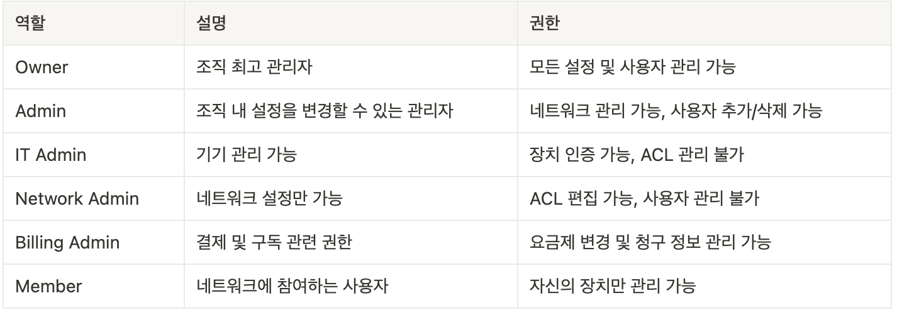

## Introduction

- Anydesk Trouble Shooting
    - Anydesk 설정 시 오류 발생 

- Tailscale with SSH
    - 본인 이외의 다른 사람의 기기에서 tailnet 내의 접속을 허용하고 싶음

## Terminology

### Display Server: Wayland and X11

| [Display Server 참고](http://en.wikipedia.org/wiki/Windowing_system#Display_server)

- Display Server

    - 운영체제, 하드웨어, GUI(Graphic User Interface) 애플리케이션 간의 입력 및 출력 처리를 담당하는 프로그램
    - 화면을 나타내고 마우스나 키보드 입력을 프로그램에 전달하는 역할

- X11 Server

    - 리눅스와 유닉스 계열 운영체제에서 사용되는 전통적인 디스플레이 서버 프로토콜
    - 클라이언트-서버 구조를 통해 화면 출력과 사용자 입력 처리
    - 성능 최적화가 부족하고 보안성이 낮아 최근에는 Wayland로 대체되는 추세
    - 동작방식
        - 키보드/마우스 입력을 받아 프로그램(X 클라이언트)으로 전달
        - 프로그램이 새로운 화면을 생성하면, 이를 X 서버가 받아서 화면에 표시

- Wayland

    - 기존의 X11이 비효율적인 점이 많아 개선하기 위해 나온 새로운 디스플레이 서버 프로토콜
    - 클라이언트가 직접 프레임버퍼(화면에 출력할 데이터를 저장하는 공간)에 그릴 수 있도록 설계
    - X11보다 보안이 강하고 성능 향상
    - 동작 방식
        - X11과 달리 별도의 컴포지터가 필요 없음
        - 애플리케이션이 직접 화면 표시

### DNS (Domain Name System)

- 개념

    - 사람이 읽을 수 있는 도메인을 머신이 읽을 수 있는 IP 주소로 변환

    - 서버에 접속할 때 IP가 아닌 도메인을 통해 접속하도록 하는 일련의 과정

    - DNS Recurisve Resolver가 여러 DNS 서버에 차례대로 요청하여 답을 찾는 과정을 재귀적 쿼리라고 함

- DNS 관련 명령어

    - `nslookup [도메인]`
    - `traceroute`

- DNS 설정 파일 
    - `/etc/resolv.conf`
        → 현재 tailscale 사용하기 때문에 아래와 같은 도메인

        
    

- **동작과정**

    1. [사용자 → 웹브라우저] 사용자가 웹 브라우저에 “example.com” 입력하면 쿼리가 인터넷으로 이동해 DNS Recursive Resolver가 이를 수신
    2. [Resolver ↔ Root Nameserver] 쿼리 후 응답
    - “.com”
    3. [Resolver ↔ TLD Nameserver] 도메인 네임 서버의 IP 주소 물어보고 응답
    - 현재 예시에서 Resolver는 “.com” TLD Nameserver에 요청
    - “example.com”
    4. [Resolver → Authoritative Nameserver(example.com)] IP 물어보고 응답
    - “IP”

### DHCP

- 개념

  - 네트워크 장치에 IP 주소, 서브넷 마스크, 게이트웨이, DNS 서버 등의 네트워크 설정 정보를 자동으로 할당하는 프로토콜

  - 해당 클라이언트에게 일정 기간 임대해줌

- **동작과정**

  1. DHCP Discover
  - 클라이언트가 네트워크에 연결되면 “내 IP 줘”라고 브로드캐스트(255.255.255.255) 요청 전송
  2. DHCP Offer
  - DHCP 서버가 사용가능한 IP 주소 제안
  3. DHCP Request
  - 클라이언트가 특정 IP 주소 요청
  4. DHCP Acknowledge
  - DHCP가 해당 IP 주소 할당하고 설정 정보 전달

## Trouble Shooting: Anydesk with WayLand

### 문제 상황

| [Anydesk Docs 참고](https://support.anydesk.com/knowledge/error-messages)

서버와 클라이언트에 Anydesk 설치 후 접속 시 오류 발생

- **"Remote display server is not supported (e.g. Wayland)"**

- Anydesk는 x11을 기준으로 작동하기 때문에 wayland와 같은 다른 디스플레이 서버를 사용하는 경우 해당 오류 발생

### 해결

서버로 사용하는 Ubuntu 22.04는 기본 디스플레이 서버로 wayland 사용

wayland를 종료시켜 x11을 사용하도록 함

- 디스플레이 서버를 조회하기 위해 아래 명령어 실행
        
    ```shell
    echo $XDG_SESSION_TYPE
    ```
        
- wayland가 나타나는 경우 종료 후 재시작
        
    ```shell
    #gdm 설정 파일 접근
    sudo vi /etc/gdm3/custom.conf
    ---
    #wayland 사용하지 않도록 설정
    WaylandEnable=false
    ---
    #gdm 재시작
    sudo service gdm3 restart
    ```

## Practice: Tailscale with SSH

### 개념

1. User Role

    > “Manage the users in your network and their permissions.”
    > 

    - 팀 내 사용자에게 RBAC(Role-based Access Control)을 사용해 User Role 부여

    - 사용자마다 다른 Role을 부여해 보안과 네트워크 관리를 효율적으로 할 수 있음

        

2. Access Control

    > “Define a policy for which devices and users are allowed to connect in your network.”
    > 

    - Tailnet 내에서 어떤 사용자가 어떤 장치에 접근할 수 있는지 정의하는 보안 정책

- Default Access Control

    - acls
        - Tailnet 관련 액세스 제어
        - `"src": ["*"]` : 모든 사용자 및 장치가
        - `"dst": ["*:*"]` : 모든 장치의 모든 포트에 접근 가능
    - ssh
        - Tailnet 내 SSH 접근 제어
        - `"src":    ["autogroup:member"]` : Tailscale에 로그인한 모든 사용자
        - `"dst":    ["autogroup:self"]` : 사용자 자신의 장치만 SSH 접근 가능
        - `"users":  ["autogroup:nonroot", "root"]` : 일반 사용자(nonroot)와 root 계정에서 SSH 허용


### 동작 과정

1. User Role 추가

    > 계정1 "psy0201123@gmail.com", 계정2 "seonieo02@gmail.com"

    a. [계정1] 이메일로 계정2 User 초대
        
        
    b. [계정2] 메일을 통해 계정2에 로그인 후 계정1의 tailnet 연결
         
        
        
    c. [계정1] Admin Console
         
        
        
2. Access Control 설정

    a. Access Control 설정 이전

    - Permission denied 오류 발생

        
    
    - 현재 Access Control이 “tailnet 주인 계정의 장치만”을 SSH만을 허용. 동일한 tailnet이라고 모두 허용하지 않음

    b. [계정1] 다른 장치(계정2)에서 접근할 수 있도록 Access Control 변경 
    > [Tailscale Docs 참고](https://tailscale.com/kb/1337/acl-syntax#ssh)
        
        
        // Example/default ACLs for unrestricted connections.
        {        
            // Define the tags which can be applied to devices and by which users.
        	"tagOwners": {
        		"tag:my-homelab": ["autogroup:owner"],
        	},
            
            // Define access control lists for users, groups, autogroups, tags,
        	// Tailscale IP addresses, and subnet ranges.
            "acls": [
        		// Allow all connections.
        		// Comment this section out if you want to define specific restrictions.
            	{"action": "accept", "src": ["*"], "dst": ["*:*"]},
        	],
            
        	// Define users and devices that can use Tailscale SSH.
        	"ssh": [
            	// Allow all users to SSH into their own devices in check mode.
            	// Comment this section out if you want to define specific restrictions.
        		{
        			"action": "check",
        			"src":    ["autogroup:member"],
            		//"dst":    ["autogroup:self"],
            		"dst":   ["tag:my-homelab"],
            		"users": ["autogroup:nonroot", "root"],
            	},
        	],
        }
        
            
    c. [계정1] Machine에 태그 추가
        1. ACL 수정한 후에도 Machine에 태그 추가해야 적용됨
        

### 결과

Tailscale을 사용해 계정2에서 계정1의 홈서버 접속 성공
    
