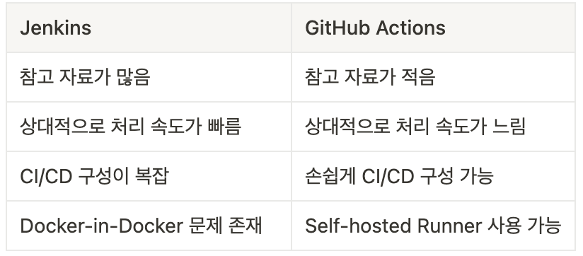
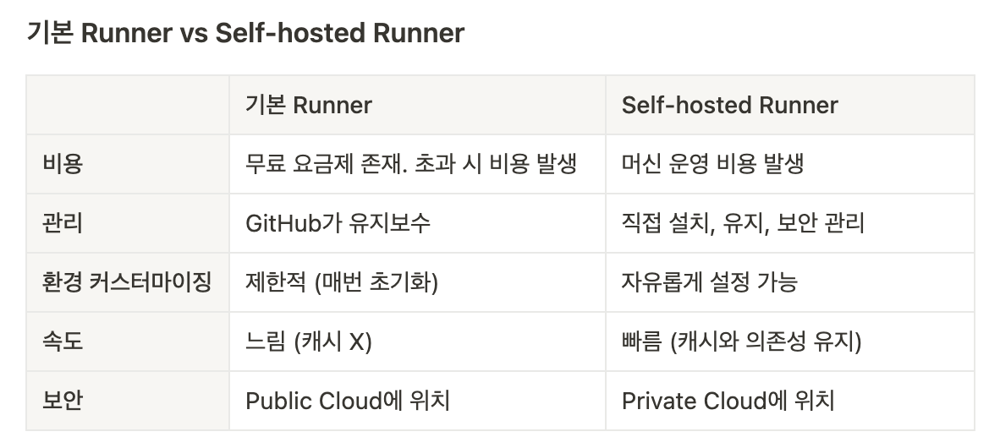
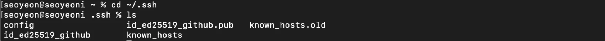
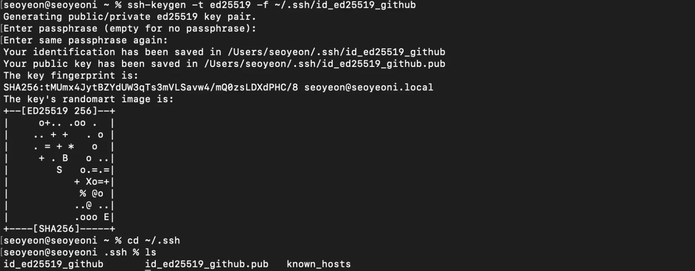
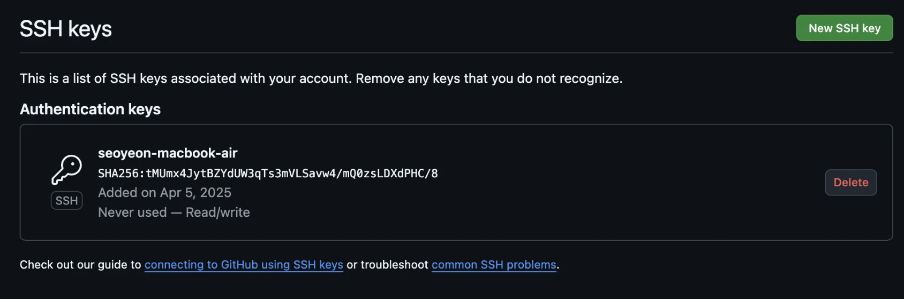
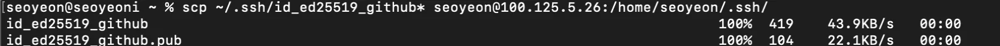
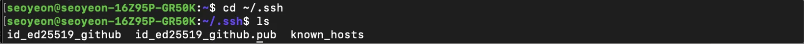
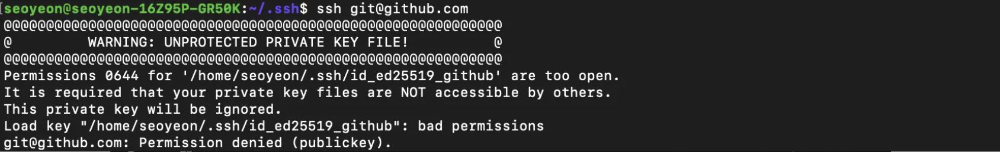

## Introduction

- GitHub Actions
    - CI/CD Tools 중 GitHub Actions가 Docker-in-Docker 문제가 발생하지 않도록 하며 간단히 구축 가능하여 채택
    - CI/CD 파이프라인 구축을 통한 자동 빌드 및 자동 배포 목적

- SSH 
    - GitHub에 SSH Key 등록해 SSH 기반 인증 사용 목적

- Secretive
    - mac 전용으로 매우 안전한 SSH 기반 인증 도구

## Terminology

### Jenkins vs GitHub Actions
### 1) Jenkins: Docker-in-Docker

> [Docker-in-Docker](https://itnext.io/docker-in-docker-521958d34efd)

- 요구사항
    - 성능과 보안에 유리하고 설정이 간단한 CI/CD 파이프라인 구축

        

- 개요
    - Jenkins 파이프라인에서 Docker 명령어를 실행할 필요 존재하고, 일반적으로 container 환경에서 동작 

    - Docker 환경에 container로 동작시키는 경우, Jenkins container 내부에서 Docker 명령어 실행해야 하므로 Docker container에서 Docker를 사용해야함 ⇒ Docker-in-Docker

    - 하지만 Docker-in-Docker는 Docker가 운영 체제에서 구현되는 방식과 관련해 많은 기술적 문제를 발생시켜 권장되지 않음 ⇒ Jenkins 대신 GitHub Actions 유리

- DIND 구현 : Docker container에서 Docker 사용하는 방법

    1. [Best Practice] Host의 Docker Daemon 마운트
        - Docker container 내부에서 Host Docker Daemon 사용
        - container 내부에 Docker Daemon에 명령을 내리는 인터페이스인 “Docker Socket” 파일 마운트
            
            ```docker
            -v /var/run/docker.sock:/var/run/docker.sock
            ```
            
            ```docker
            #실제 사용 예시
            docker run -ti -v /var/run/docker.sock:/var/run/docker.sock docker
            ```
            
        - 보안에 유의해야 함
    2. Docker container 내부에서 “실제 Docker” 사용
        - Docker container 내부에서 실제 Docker 사용
            
            ```docker
            docker run --privileged -d docker:dind
            ```
            
        - 리소스 낭비가 심해 실제 Docker를 설치해 사용할 필요 없음

    ⇒ **Docker-in-Docker를 구현해 사용할 수 있지만 다양한 문제 발생**


- DIND로 인해 발생하는 문제
    - 성능 저하 
        - Docker container 안에서 다시 Docker Daemon을 실행하는 경우, 중첩된 container 환경이 되어 성능 저하 발생
        - 이미지 build, run 작업이 느리고 자원 낭비도 많아짐
    - 볼륨 마운트 문제
        - Jenkins container 내부에서 실행한 Docker가 Host의 파일 시스템을 제대로 마운트하지 못하는 경우 존재
        - container 내의 Docker에서 작동하지 않거나 이상한 경로로 마운트될 수 있음
    - Docker socket 공유 시 보안 문제 
        - 일반적으로 Docker Socket 공유해 Host Docker 공유 → Best Practice
        - Jenkins container 내부에서 Host Docker를 직접 제어할 수 있지만, 보안상 매우 위험
            - Jenkins에서 루트 권한 수준으로 제어가 가능해 Host 시스템에 대한 보안 위험 존재
    - 캐시가 정상적으로 안 되어 비효율적
        - Docker-in-Docker는 기본적으로 매번 새로운 Docker Daemon을 실행하므로 이미지 캐시가 제대로 유지되지 않음
        - 매 빌드마다 이미지를 처음부터 다시 빌드

### 2) GitHub Actions: Self-hosted Runner

- 개요
    - GitHub Actions에서 기본으로 제공하는 Runner가 아닌, 본인의 Docker container 내에 Runner를 띄워 CI/CD 작업 수행 가능

    - Self-hosted Runner란, GitHub Actions에서 사용자가 지정하는 로컬 컴퓨팅 자원으로 빌드를 수행하도록 설정하는 기능

- 기본 Runner vs Self-hosted Runner
    

    - Self-hosted Runner를 VM(홈서버)에 설치해 사용하는 경우 Docker-in-Docker 문제가 발생하지 않고 보안, 성능 측면에서 가장 유리 


**❓Jenkins와 Self-hosted Runner를 container에서 동작하면 둘 다 docker-in-docker 문제가 발생하고, vm에서 동작하면 둘 다 docker-in-docker 문제가 발생하지 않는 것 아닌가요?**

- Jenkins는 대체로 container로 돌리기 때문에 Docker-in-Docker 문제를 피할 수 없지만, GitHub Actions는 기본 Runner(VM)을 제공해 Docker-in-Docker 없이 Docker 작업 가능

- 기본 Runner는 VM에서 동작하고, Self-hosted Runner는 VM 또는 container 중 선택 가능

- Jenkins도 VM에 동작할 수 있지만, GitHub Actions에 비해 설정이 복잡

- 본인은 VM에 Self-hosted Runner를 돌려 Docker-in-Docker의 성능 문제와 보안, 캐시 문제 해결


### SSH

- 개요
    - SSH(Secure Shell Protocol)을 사용해 원격 서버 및 서비스에 연결하고 인증 가능

    - 보안되지 않은 네트워크를 통해 보안 채널 제공


- 파일 경로

    - `~/.ssh` : SSH 관련 파일을 저장하는 폴더

    - `~/.ssh/known_hosts` : SSH 명령어를 통해 접속했던 서버 목록을 담은 파일

    - `~/.ssh/config` : SSH 접속 설정 파일

    - 현재 본인 컴퓨터

        - GitHub SSH key 생성 & config 설정

            


### Secretive

> [Secretive GitHub](https://github.com/maxgoedjen/secretive)

- 개요

    - macOS의 보안 기능(Secure Enclave)를 활용해 SSH key와 인증서를 더 안전하게 생성하고 저장하는 도구

    - Secure Enclave란,
        - Apple에서 만든 독립적인 보안 프로세서로 민감한 데이터를 안전하게 처리하고 저장하는데 사용
        - 메인 CPU 외의 프로세서로, 독자적인 OS와 암호화된 메모리 사용 → 저장된 데이터는 Secure Enclave 내부에만 존재하고 외부로 유출되지 않음

- 사용 목적

    - mac은 SSH key를 파일로 가지고 있어 키 복사 또는 유출의 가능성이 있지만, Secretive는 key를 디스크에 저장하지 않아 생성한 키 복사 불가능 

    - Touch ID로 접근 통제

        ⇒ 민감한 키를 더 안전하게 보호하고 싶을 때 사용


- 한계
    - mac 초기화 시 key가 사라지며, 백업 불가능

    - macOS의 Secure Enclave가 지원되는 경우만 사용할 수 있다는 한계 존재


## Practice: SSH로 Git 접속

### 1. 새 SSH Key 생성

1. `-t ed25519` : 최신 알고리즘
2. `-C` : GitHub 계정 이메일 작성
    
    ```docker
    ssh-keygen -t ed25519 -f ~/.ssh/id_ed25519_github
    ```
    
3. 생성 결과
    - Secret Key 경로 `~/.ssh/id_ed25519_github`
    - Public Key 경로 `~/.ssh/id_ed25519_github.pub`
    
        


### 2. GitHub에 Public Key 등록

1. GitHub > Settings > SSH and GPG keys
2. New SSH key
3. 직전에 생성한 Public Key 파일 내용 붙여넣기
    
    ```docker
    cat ~/.ssh/id_ed25519_github.pub
    ```
    

    

### 3. SSH Agent에 key 등록

SSH 연결 시마다 암호를 입력하지 않기 위해 정보 캐싱

```docker
eval "$(ssh-agent -s)" #SSH Agent 백그라운드로 시작
ssh-add ~/.ssh/id_ed25519_github #생성한 개인키를 SSH Agent에 등록해 자동 인증 설정
```

### 4. GitHub SSH 연결 확인

```docker
ssh -T git@github.com
```


### 5. (선택) GitHub에 사용할 SSH Key 연동

1. SSH key를 기본 이름으로 사용하는 경우 안 해도 됨
2. BUT 추후 사용하는 key가 여러 개일 수 있으니 이름 다르게 설정한 후 파일 수정
    - Host: 해당 설정은 github.com 접속 시 사용
    - IdentityFile: 연결 시 사용할 key 위치
    - AddKeysToAgent: SSH key를 자동으로 SSH Agent 등록
    - UseKeyChain: macOS 키체인에 암호 추가
    
    ```bash
    # ~/.ssh/config
    Host github.com
    	IdentityFile ~/.ssh/id_ed25519_github
    	AddKeysToAgent yes
    	UseKeychain yes
    ```
    

### 6. (선택) [클라이언트] 서버에 SSH Key 복사

[클라이언트] 서버에 SSH Key 복사

```bash
scp ~/.ssh/id_ed25519_github* seoyeon@100.125.5.26:/home/seoyeon/.ssh/
```



오류 발생 → Private Key는 본인만 읽을 수 있는 권한을 가져야 함



[서버] 파일 권한 부여

```bash
chmod 600 ~/.ssh/id_ed25519_github
```


## Practice: GitHub Actions