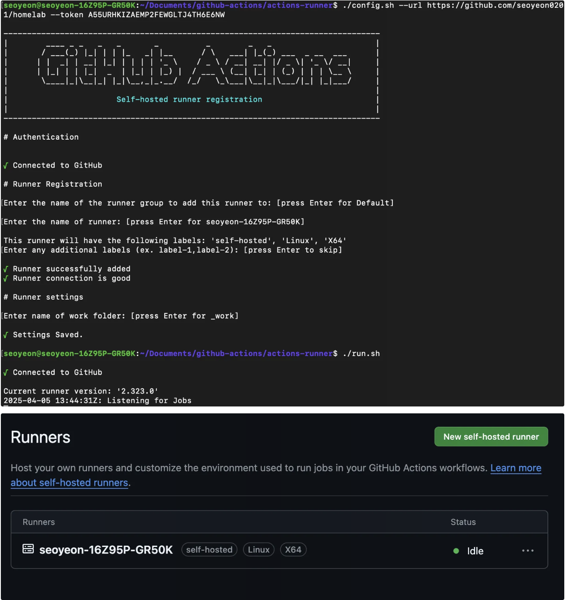
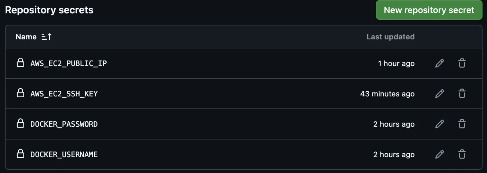
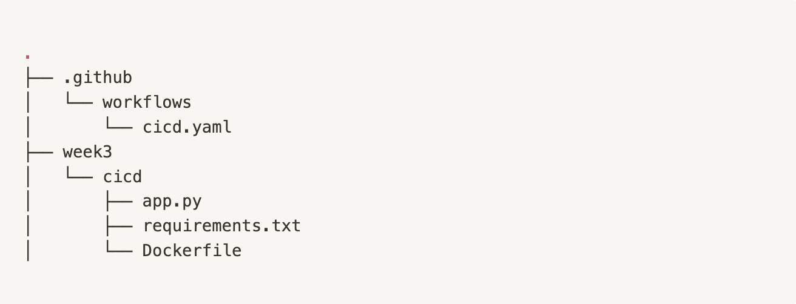
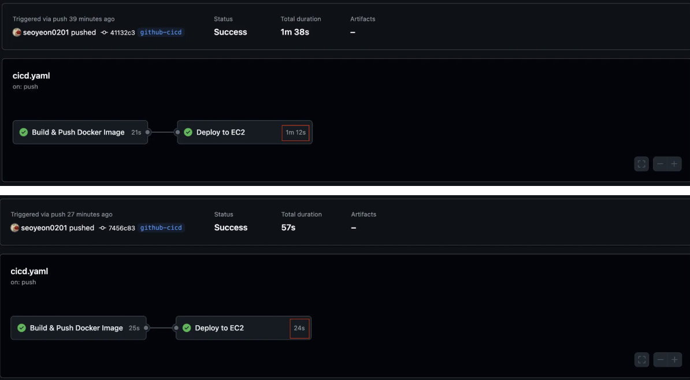

## Introduction

- CI/CD 파이프라인 구축
    - CI/CD 파이프라인 구축을 통한 이미지 자동 빌드 및 자동 배포 목적
    - **Jenkins vs GitHub Actions**

        - CI/CD Tools 중 GitHub Actions가 Docker-in-Docker 문제가 발생하지 않도록 함 → VM에 배포
        - VM 배포 시 설정이 간단한 CI/CD Tools 선택 → GitHub Actions
    - **GitHub-hosted Runner vs Self-hosted Runner**

        - 비용, 유지 보수, 성능 측면에서 유리한 Self-hosted Runner 사용
    
        ⇒ GitHub Actions Self-hosted Runner 사용해 CI/CD 구축

- SSH 
    - GitHub에 SSH Key 등록해 SSH 기반 인증 사용 목적

- Secretive
    - mac 전용으로 매우 안전한 SSH 기반 인증 도구

## Terminology

### Jenkins vs GitHub Actions
### 1) Jenkins: Docker-in-Docker

> [Docker-in-Docker](https://itnext.io/docker-in-docker-521958d34efd)

- 요구사항
    - 성능이 좋고 설정이 간단한 CI/CD 파이프라인 구축

- 개요
    - Jenkins 파이프라인에서 Docker 명령어를 실행할 필요 존재하고, 일반적으로 container 환경에서 동작 

    - Docker 환경에 container로 동작시키는 경우, Jenkins container 내부에서 Docker 명령어 실행해야 하므로 Docker container에서 Docker를 사용해야함 

        ⇒ Docker-in-Docker

    - 하지만 Docker-in-Docker는 Docker가 운영 체제에서 구현되는 방식과 관련해 많은 기술적 문제를 발생시켜 권장되지 않음 ⇒ 해결하기 위해 VM 환경에 운영 필요
        - BUT VM에 Jenkins 사용 시 설정이 매우 복잡해 일반적으로 container 권장

- DIND 구현 : Docker container에서 Docker 사용하는 방법

    1. [Best Practice] Host의 Docker Daemon 마운트

        - Docker container 내부에서 Host Docker Daemon 사용
        - container 내부에 Docker Daemon에 명령을 내리는 인터페이스인 “Docker Socket” 파일 마운트
            
            ```docker
            -v /var/run/docker.sock:/var/run/docker.sock
            ```
            
            ```docker
            #실제 사용 예시
            docker run -ti -v /var/run/docker.sock:/var/run/docker.sock docker
            ```
            
        - 보안에 유의해야 함
    2. Docker container 내부에서 “실제 Docker” 사용
        - Docker container 내부에서 실제 Docker 사용
            
            ```docker
            docker run --privileged -d docker:dind
            ```
            
        - 리소스 낭비가 심해 실제 Docker를 설치해 사용할 필요 없음

    ⇒ **Docker-in-Docker를 구현해 사용할 수 있지만 다양한 문제 발생**


- DIND로 인해 발생하는 문제
    - 성능 저하 
        - Docker container 안에서 다시 Docker Daemon을 실행하는 경우, 중첩된 container 환경이 되어 성능 저하 발생
        - 이미지 build, run 작업이 느리고 자원 낭비도 많아짐
    - 볼륨 마운트 문제
        - Jenkins container 내부에서 실행한 Docker가 Host의 파일 시스템을 제대로 마운트하지 못하는 경우 존재
        - container 내의 Docker에서 작동하지 않거나 이상한 경로로 마운트될 수 있음
    - Docker socket 공유 시 보안 문제 
        - 일반적으로 Docker Socket 공유해 Host Docker 공유 → Best Practice
        - Jenkins container 내부에서 Host Docker를 직접 제어할 수 있지만, 보안상 매우 위험
            - Jenkins에서 루트 권한 수준으로 제어가 가능해 Host 시스템에 대한 보안 위험 존재
    - 캐시가 정상적으로 안 되어 비효율적
        - Docker-in-Docker는 기본적으로 매번 새로운 Docker Daemon을 실행하므로 이미지 캐시가 제대로 유지되지 않음
        - 매 빌드마다 이미지를 처음부터 다시 빌드

### 2) GitHub Actions: Self-hosted Runner

- 개요

    - 비용, 유지 보수, 성능 이슈로 GitHub Actions에서 기본으로 제공하는 GitHub-hosted Runner가 아닌 Self-hosted Runner를 사용해 CI/CD 작업 수행

    - Self-hosted Runner란, GitHub Actions에서 사용자가 지정하는 로컬 컴퓨팅 자원으로 빌드를 수행하도록 설정하는 기능

- 기본 Runner vs Self-hosted Runner

    - 기본 Runner는 VM에서 동작하고, Self-hosted Runner는 VM 또는 container 중 선택해 운영 가능
    - GitHub-hosted Runner와 Self-hosted Runner를 VM(홈서버)에 설치해 사용하는 경우 Docker-in-Docker 문제가 발생하지 않음
    - 비용
        - GitHub-hosted Runner는 제한된 무료 실행 시간 이후 비용 발생
        - Self-hosted Runner는 사용 비용 없고 서버 유지 비용만 부담
    - 유지 보수
        - GitHub-hosted Runner는 GitHub가 인프라 관리
        - Self-hosted Runner는 사용자가 인프라 관리 및 유지 보수 가능
    - 수행 시간
        - GitHub-hosted Runner는 Job 실행 시마다 새로운 VM을 부팅하고 필요한 패키지를 모두 설치하는 과정을 거침
        - Self-hosted Runner는 동일한 VM에서 동작하여 매번 패키지를 설치할 필요가 없음 
        
        →  GitHub-hosted Runner는 스토리지와 캐시가 제한적이지만, Self-hosted Runner는 로컬 캐시를 사용할 수 있어 속도 절감 효과 
    
    ⇒ Self-hosted Runner가 GitHub-hosted Runner에 비해 비용, 유지 보수, 성능 측면에서 유리 


**❓Jenkins와 Self-hosted Runner를 container에서 동작하면 둘 다 docker-in-docker 문제가 발생하고, vm에서 동작하면 둘 다 docker-in-docker 문제가 발생하지 않는 것 아닌가요?**

- Jenkins는 보통 container로 돌리기 때문에 Docker-in-Docker 문제를 피할 수 없지만, GitHub Actions는 GitHub-hosted Runner(VM) 또는 Self-hosted Runner를 VM 환경에 운영해 Docker-in-Docker 없이 Docker 작업 가능

- Jenkins도 VM에 동작할 수 있지만, GitHub Actions에 비해 설정이 복잡


    **⇒ 본인은 VM에 Self-hosted Runner를 돌려 Jenkins의 Docker-in-Docker의 성능 문제를 해결하고, GitHub-hosted Runner의 비용과 성능 문제 보안**


### SSH

- 개요
    - SSH(Secure Shell Protocol)을 사용해 원격 서버 및 서비스에 연결하고 인증 가능

    - 보안되지 않은 네트워크를 통해 보안 채널 제공


- 파일 경로

    - `~/.ssh` : SSH 관련 파일을 저장하는 폴더

    - `~/.ssh/known_hosts` : SSH 명령어를 통해 접속했던 서버 목록을 담은 파일

    - `~/.ssh/config` : SSH 접속 설정 파일

    - 현재 본인 컴퓨터

        - GitHub SSH key 생성 & config 설정

            


### Secretive

> [Secretive GitHub](https://github.com/maxgoedjen/secretive)

- 개요

    - macOS의 보안 기능(Secure Enclave)를 활용해 SSH key와 인증서를 더 안전하게 생성하고 저장하는 도구

    - Secure Enclave란,
        - Apple에서 만든 독립적인 보안 프로세서로 민감한 데이터를 안전하게 처리하고 저장하는데 사용
        - 메인 CPU 외의 프로세서로, 독자적인 OS와 암호화된 메모리 사용 → 저장된 데이터는 Secure Enclave 내부에만 존재하고 외부로 유출되지 않음

- 사용 목적

    - mac은 SSH key를 파일로 가지고 있어 키 복사 또는 유출의 가능성이 있지만, Secretive는 key를 디스크에 저장하지 않아 생성한 키 복사 불가능 

    - Touch ID로 접근 통제

        ⇒ 민감한 키를 더 안전하게 보호하고 싶을 때 사용


- 한계
    - mac 초기화 시 key가 사라지며, 백업 불가능

    - macOS의 Secure Enclave가 지원되는 경우만 사용할 수 있다는 한계 존재


## Practice: SSH로 Git 접속

### 1. 새 SSH Key 생성

1. `-t ed25519` : 최신 알고리즘
2. `-C` : GitHub 계정 이메일 작성
    
    ```docker
    ssh-keygen -t ed25519 -f ~/.ssh/id_ed25519_github
    ```
    
3. 생성 결과
    - Secret Key 경로 `~/.ssh/id_ed25519_github`
    - Public Key 경로 `~/.ssh/id_ed25519_github.pub`
    
        


### 2. GitHub에 Public Key 등록

1. GitHub > Settings > SSH and GPG keys
2. New SSH key
3. 직전에 생성한 Public Key 파일 내용 붙여넣기
    
    ```docker
    cat ~/.ssh/id_ed25519_github.pub
    ```
    

    

### 3. SSH Agent에 key 등록

SSH 연결 시마다 암호를 입력하지 않기 위해 정보 캐싱

```docker
eval "$(ssh-agent -s)" #SSH Agent 백그라운드로 시작
ssh-add ~/.ssh/id_ed25519_github #생성한 개인키를 SSH Agent에 등록해 자동 인증 설정
```

### 4. GitHub SSH 연결 확인

```docker
ssh -T git@github.com
```


### 5. (선택) GitHub에 사용할 SSH Key 연동

1. SSH key를 기본 이름으로 사용하는 경우 안 해도 됨
2. BUT 추후 사용하는 key가 여러 개일 수 있으니 이름 다르게 설정한 후 파일 수정
    - Host: 해당 설정은 github.com 접속 시 사용
    - IdentityFile: 연결 시 사용할 key 위치
    - AddKeysToAgent: SSH key를 자동으로 SSH Agent 등록
    - UseKeyChain: macOS 키체인에 암호 추가
    
    ```bash
    # ~/.ssh/config
    Host github.com
    	IdentityFile ~/.ssh/id_ed25519_github
    	AddKeysToAgent yes
    	UseKeychain yes
    ```
    

### 6. (선택) [클라이언트] 서버에 SSH Key 복사

[클라이언트] 서버에 SSH Key 복사

```bash
scp ~/.ssh/id_ed25519_github* seoyeon@100.125.5.26:/home/seoyeon/.ssh/
```


오류 발생 → Private Key는 본인만 읽을 수 있는 권한을 가져야 함


[서버] 파일 권한 부여

```bash
chmod 600 ~/.ssh/id_ed25519_github
```


## Practice: GitHub Actions

### 1. [서버&GitHub] Self-hosted Runner 생성 및 실행

1. 서버의 아키텍처 확인

    ```
    dpkg --print-architecture
    #amd64 출력
    ```

2. Github Repository > Settings > Actions-Runners에서 Self-hosted Runner 생성

3. 서버에 코드 붙여넣어 생성
    1. Download
        
        ```bash
        # Create a folder
        $ mkdir actions-runner && cd actions-runner

        # Download the latest runner package
        $ curl -o actions-runner-linux-x64-2.323.0.tar.gz -L https://github.com/actions/runner/releases/download/v2.323.0/actions-runner-linux-x64-2.323.0.tar.gz
        
        # Optional: Validate the hash
        $ echo "0dbc9bf5a58620fc52cb6cc0448abcca964a8d74b5f39773b7afcad9ab691e19  actions-runner-linux-x64-2.323.0.tar.gz" | shasum -a 256 -c
        
        # Extract the installer
        $ tar xzf ./actions-runner-linux-x64-2.323.0.tar.gz
        ```
        
    2. Configure → 실행
        
        ```bash
        # Create the runner and start the configuration experience
        $ ./config.sh --url https://github.com/seoyeon0201/homelab --token A55URHKIZAEMP2FEWGLTJ4TH6E6NW
        
        # Last step, run it!
        $ ./run.sh
        ```
        
        
        
    3. 추후 Workflow에 아래와 같이 작성
        
        ```bash
        # Use this YAML in your workflow file for each job
        runs-on: self-hosted
        ```

### 2. [서버] Runner 돌리는 용도로 시스템 User 생성

**User란,**

사용자 User란 컴퓨터 시스템에 로그인할 수 있는 계정

root 계정은 시스템 전체를 통제할 수 있기에 적절한 권한만을 부여한 User 생성해 GitHub Actions Runner 동작


Self-hosted Runner에서 `sudo` 명령어 사용 시 매번 비밀번호를 입력해야 함

- 비밀번호 입력하지 않아도 되도록 설정

- `sudo visudo` 수정
    ```
    seoyeon ALL=(ALL) NOPASSWD:ALL
    ```


### 3. [GitHub&AWS] CI/CD 환경 설정

1. 배포 환경 설정

- AWS EC2
- AWS Security Group

2. GitHub Secrets

- Docker 관련 정보
- AWS 관련 정보

    

### 4. [GitHub] CICD 파이프라인 구축

파일 구조 



코드 작성

- cicd.yaml
- app.py
- requirements.txt
- Dockerfile

### 5. 결과

- cicd.yaml 또는 week3/cicd 코드에 변경 사항 존재 시 CI/CD workflows 동작
    
    - 빌드 및 배포 자동화를 통해 휴먼 에러 방지

- Jenkins와 비교
    - VM 환경에 간단히 CICD 구축 가능 

- GitHub-hosted Runner와 비교
    - Self-hosted Runner가 캐시를 저장해 성능 향상
    
    